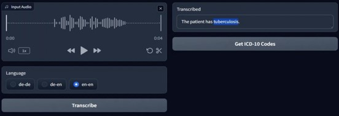
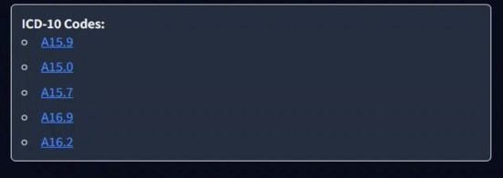

# MVP Demo App

This MVP predicts ICD-10 codes from user input.

The app uses a locally running whisper-base model (OpenAI) to transcribe audio to text. To predict ICD-10 codes a prompt engenieered DeepSeek-V3 API call is used.


**Input panels**
The Audio input panel allows users to record audio and transcribe it, while the Text input panel allows users to enter text directly.


**Output panel**
The Output panel displays the predicted ICD-10 codes and links them to the ICD website. The codes are ordered by importance.



## How to run
**1. Setup API key(s)**

Create a *api_keys.yml* file in the root directory with the following content:
```yaml
deepseek:
    - <your_deepseek_api_key>
```

**2. Run app**
- Option 1: Using uv (recommended): `uv run mvp.py`
- Option 2: Using python
   - Install dependencies: `pip install -r requirements.txt`
   -  Run: `python mvp.py`

**3. Open in browser**
Go to http://localhost:7860
